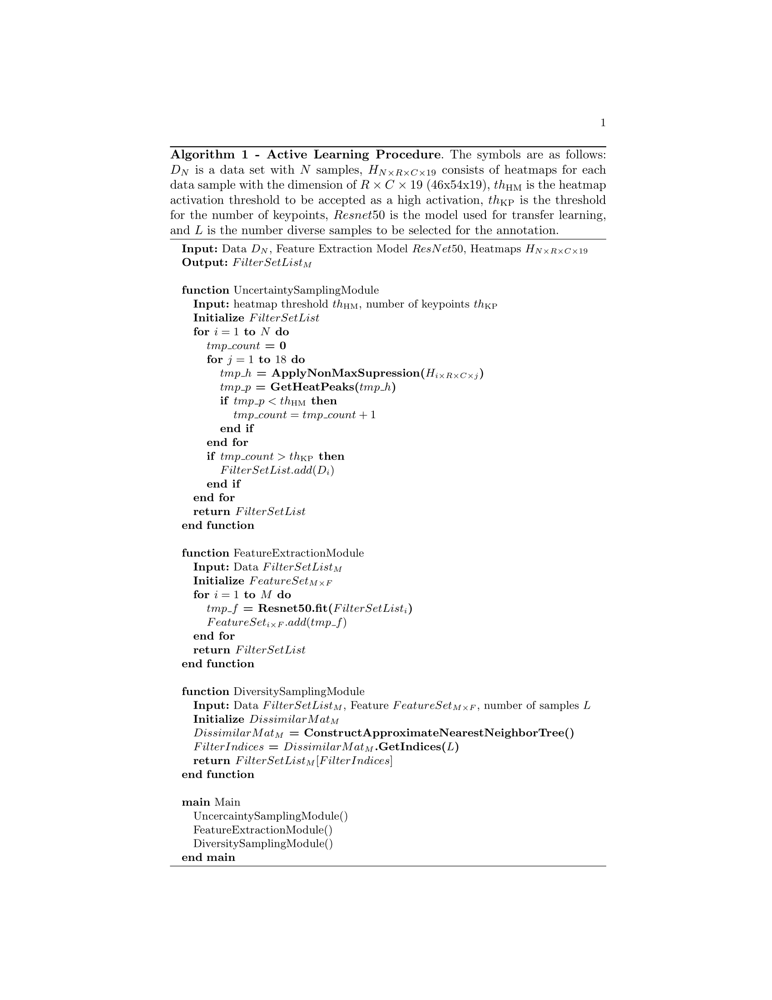

# S-SPRR2020ALpose - A Practical Hybrid Active Learning Approach for Human Pose Estimation

## Synopsis

The files presented here are as part of  our submitted paper to [S+SSPR 2020](https://www.dais.unive.it/sspr2020/). The source code and the extra materials will be published after the notification of decision. The proposed Active Learning approach for human pose estimation is shown in below figure. 
 

  

## Algorithm
The implemented AL strategy is demonstrated in the following algorithm.

